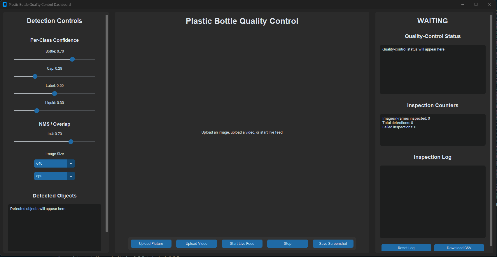
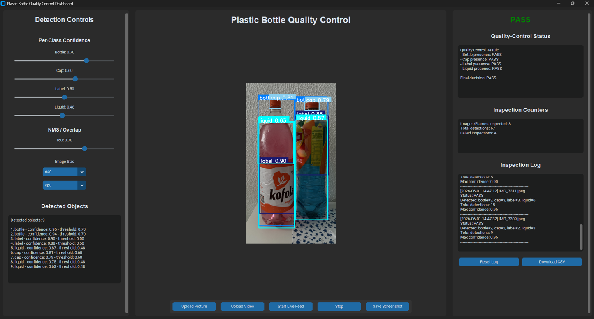
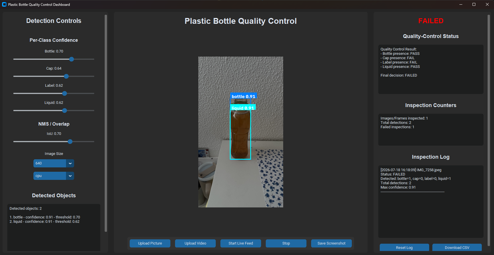
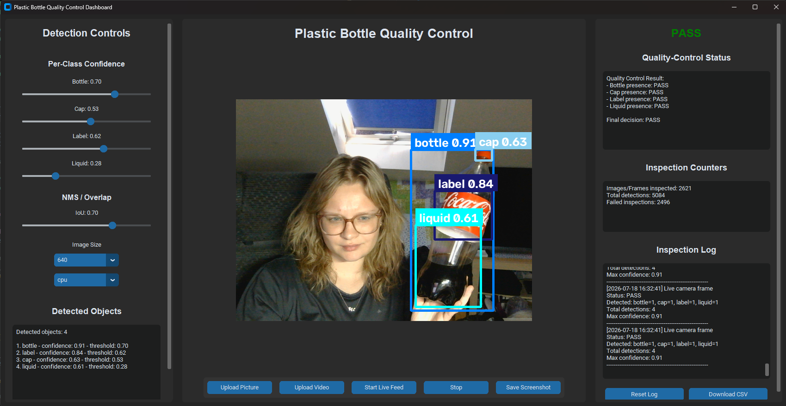

<div align="center">

# 🧋 Plastic Bottle Detection

A desktop computer-vision application for inspecting plastic bottles with a custom-trained **YOLOv8** object-detection model.

The application verifies whether a bottle contains all four required components — **bottle, cap, label, and liquid** — and assigns an automatic **PASS** or **FAILED** quality-control result.


</div>

---

## About the project

This project demonstrates how object detection can support a simple industrial quality-control process.

A bottle passes inspection only when the model detects all required classes:

- `bottle`
- `cap`
- `label`
- `liquid`

If one or more components are missing, the inspection result is marked as **FAILED**.

The prototype supports static images, video files, and a live camera feed. It displays annotated detections, confidence scores, object counts, quality-control status, inspection counters, and an exportable inspection log.

> This is an educational prototype, not a production-certified inspection system.

---

## Screenshots

Create a `docs/images` directory and add your prepared screenshots using the filenames below.

### Application dashboard

<p align="center">
  
</p>

### Inspection results

<p align="center">
  
  
</p>

### Input modes - live camera

<p align="center">
  
</p>

---

## Features

- Upload and inspect an image
- Upload and process a video
- Inspect bottles through a live camera feed
- Run inference with a custom-trained YOLOv8 model
- Display bounding boxes, class names, and confidence values
- Evaluate bottle completeness as **PASS** or **FAILED**
- Show per-class object counts
- Adjust the confidence threshold for each class
- Adjust the IoU/NMS threshold
- Configure inference image size
- Track inspection and failure counters
- Maintain an inspection log
- Export inspection history to CSV
- Save annotated screenshots and outputs
- Stop active video or camera processing

---

## Quality-control logic

The inspection result follows a simple rule:

```text
PASS   = bottle + cap + label + liquid detected
FAILED = one or more required classes missing
```

Conceptually:

```python
required_classes = {"bottle", "cap", "label", "liquid"}

status = (
    "PASS"
    if required_classes.issubset(detected_classes)
    else "FAILED"
)
```

The application checks the presence of required classes. It does not currently verify barcode correctness, label text, bottle shape defects, expiration dates, exact liquid volume, or product identity.

---

## Model performance

The final application uses a locally trained **YOLOv8m** model.

| Metric | Result |
|---|---:|
| Precision | 0.629 |
| Recall | 0.560 |
| mAP@50 | 0.545 |
| mAP@50–95 | 0.349 |
| Best result | Epoch 19 |
| Model size | 49.6 MB |
| Image inference | Usually under 2 seconds |
| Video inference | Approximately 3–5 FPS |
| Live-camera inference | Approximately 3–5 FPS |

These results are suitable for demonstrating the complete detection and quality-control workflow, but they also show opportunities for further dataset and model improvement.

---

## Model training

| Setting | Value |
|---|---|
| Architecture | YOLOv8m |
| Epochs | 100 |
| Input image size | 640 px |
| Batch size | 16 |
| Training IoU threshold | 0.70 |
| Patience | 50 |
| Optimizer | Auto |
| Training duration | Approximately 26 hours |

The model was trained locally and exported as a PyTorch `.pt` file.

---

## Dataset

The custom dataset originally contained **680 images** collected in different environments, including grocery stores, home settings, and older gallery photographs.

The original split was:

| Split | Images | Percentage |
|---|---:|---:|
| Training | 476 | 70% |
| Validation | 136 | 20% |
| Test | 68 | 10% |

Training images were augmented in Roboflow, while the validation and test sets remained unchanged.

### Class annotations

| Class | Number of annotations |
|---|---:|
| Bottle | 3,581 |
| Cap | 2,730 |
| Label | 2,551 |
| Liquid | 2,290 |

### Data augmentation

| Augmentation | Setting |
|---|---|
| Outputs per training example | 3 |
| Grayscale | 15% of images |
| Hue | −40° to +40° |
| Saturation | −25% to +25% |
| Exposure | −12% to +12% |

Rotation augmentation was intentionally omitted because bottles are expected to remain upright in the target inspection scenario.

---

## Recommended detection thresholds

| Class | Default confidence |
|---|---:|
| Bottle | 0.70 |
| Cap | 0.64 |
| Label | 0.62 |
| Liquid | 0.62 |

Recommended IoU/NMS threshold:

```text
0.70
```

Lower confidence thresholds can improve recall but may introduce false detections. Higher thresholds can reduce false positives but may miss smaller or difficult objects.

---

## Project structure

```text
PlasticBottleDetector/
├── app/
│   ├── app.py
│   └── requirements.txt
├── dataset/
│   ├── test/
│   │   ├── images/
│   │   └── labels/
│   ├── train/
│   │   ├── images/
│   │   ├── labels/
│   │   └── labels.cache
│   ├── valid/
│   │   ├── images/
│   │   ├── labels/
│   │   └── labels.cache
│   ├── data.yaml
│   └── dataset.md
├── models/
│   └── model_1/
│       ├── weights/
│       │   ├── best.pt
│       │   └── last.pt
│       ├── model_card.md
│       ├── model_manifest.json
│       └── train_config.yaml
├── README.md
├── tutorial_yolo.ipynb
└── yolov8m.pt
```

---

## Getting started

### Prerequisites

Install:

- [Python 3](https://www.python.org/downloads/)
- Git
- A webcam for live inspection
- A supported local Python environment

A dedicated virtual environment is recommended.

### 1. Clone the repository

```bash
git clone https://github.com/apolkova/PlasticBottleDetector.git
cd PlasticBottleDetector
```

### 2. Create a virtual environment

#### Windows

```bat
python -m venv .venv
.venv\Scripts\activate
```

#### Linux or macOS

```bash
python3 -m venv .venv
source .venv/bin/activate
```

### 3. Install dependencies

```bash
cd app
pip install -r requirements.txt
```

### 4. Check the model path

Verify that the trained model exists at:

```text
models/model_1/weights/best.pt
```

If the application expects a different relative path, update the model path in `app.py`.

### 5. Run the application

From the `app` directory:

```bash
python app.py
```

On some Linux or macOS installations:

```bash
python3 app.py
```

---

## How to use

### Image inspection

1. Click **Upload Picture**.
2. Select a supported image.
3. Wait for YOLOv8 inference.
4. Review the annotated output.
5. Check the final **PASS** or **FAILED** status.
6. Save the annotated result when needed.

### Video inspection

1. Click **Upload Video**.
2. Select a video file.
3. The application processes individual frames.
4. Review detections and the current inspection state.
5. Click **Stop** to end processing.

### Live-camera inspection

1. Connect or enable a camera.
2. Click **Start Live Feed**.
3. Position the bottle inside the camera view.
4. Review detections in real time.
5. Click **Stop** when finished.

---

## User interface

| Panel | Content |
|---|---|
| Left | Per-class confidence sliders, IoU setting, image size, detected objects |
| Center | Image, video, or live-camera preview |
| Right | PASS/FAILED status, counters, inspection log, CSV export |

---

## Inspection log

Each inspection can be recorded and exported to CSV.

```text
timestamp
source
status
bottle_count
cap_count
label_count
liquid_count
total_detections
max_confidence
```

This makes the prototype useful for demonstrating traceability and simple quality-control reporting.

---

## Known limitations

The model performs best when the bottle is upright, the full bottle is visible, lighting is sufficient, the background is not excessively cluttered, and the cap, label, and liquid level are clearly visible.

Common failure modes include:

- missed caps because they are small,
- missed liquid in transparent or dark bottles,
- duplicate liquid detections,
- labels affected by glare or reflections,
- missed components on partially visible bottles,
- reduced accuracy with cluttered backgrounds.

---

## Possible improvements

- Add more close-up and side-angle cap images
- Add more transparent, dark, and colored-liquid examples
- Improve labels for duplicate-liquid cases
- Add more reflective and glare-heavy label examples
- Add more partially visible bottle examples
- Use a fixed production-line camera setup
- Add object tracking between video frames
- Add batch processing for folders
- Add automated model and application tests
- Add configuration files for thresholds and model paths
- Package the application as a standalone executable
- Add GPU/CPU device selection
- Add deployment benchmarks on different hardware
- Add a project license


## Disclaimer

This application is an educational demonstration of computer vision in industrial quality control.

The model and PASS/FAILED logic should be tested, validated, and adapted before any real production use. Detection results may be affected by lighting, camera placement, bottle material, reflections, occlusion, image quality, and other environmental factors.

---

## Author

Developed by [apolkova](https://github.com/apolkova).

Developed as an educational computer-vision and quality-control project.